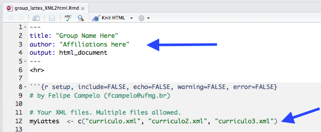

# Lattes XML to HTML
R Markdown script to extract publications (journal papers, conference papers, and book chapters) from XML files generated by the Lattes CV System

## How to use (single CV)

1) Download your Lattes CV in XML format (top right of the Lattes CV page). Save it in your working folder as "curriculo.xml"


2) Edit the *lattes_XML2html.Rmd* file with your name and affiliation.


3) Knit to html:

```
# install.packages("rmarkdown")
library(rmarkdown)
rmarkdown::render(input = "lattes_XML2html.Rmd", output_file = "myPubs.html")
```

*****

## How to use (multiple CVs)

If you want to generate a publication list from multiple Lattes CVs (e.g., for your research group), without duplicated entries due to co-authored works:

1) Download all Lattes CVs in XML format (see above)

2) Edit the *group_lattes_XML2html.Rmd* file with your group name, affiliation, and xml filenames.



3) Knit to html:

```
# install.packages("rmarkdown")
library(rmarkdown)
rmarkdown::render(input = "group_lattes_XML2html.Rmd", output_file = "myGroupPubs.html")
```

That's all!  
Cheers,  
Felipe
