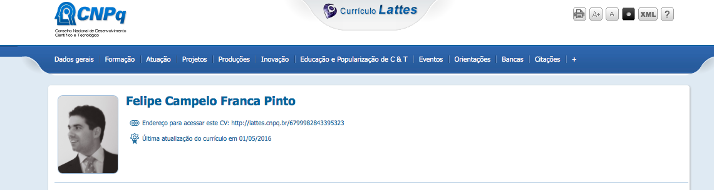
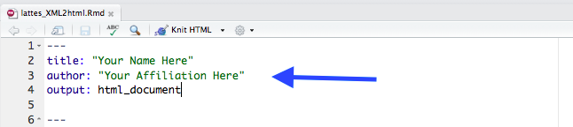

# Lattes XML to HTML
R Markdown script to extract publications (journal papers, conference papers, and book chapters) from XML files generated by the Lattes CV System

## How to use:

1) Download your Lattes CV in XML format (top right of the Lattes CV page). Save it in your working folder as "curriculo.xml"



2) Edit the _lattes_XML2html.Rmd_ file with your name and affiliation.



3) Knit to html:

```
# install.packages("rmarkdown")
library(rmarkdown)
rmarkdown::render(input = "lattes_XML2html.Rmd", output_file = "teste.html")
```

That's all!  
Cheers,  
Felipe
