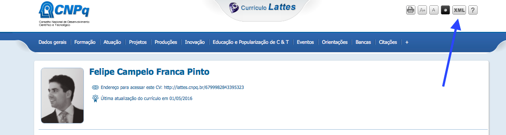
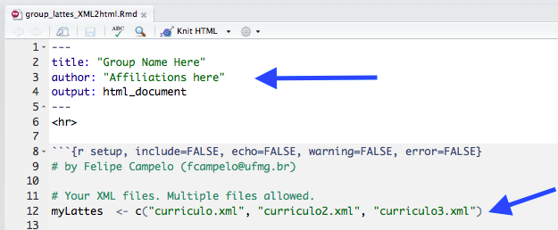

# Lattes XML to HTML
R Markdown script to extract publications (journal papers, conference papers, and book chapters) from XML files generated by the Lattes CV System

## How to use

(_Note: If you use this script and publish the resulting page anywhere, please let me know - I take some pride in these small things. ;-)_)

If you want to generate a publication list from multiple Lattes CVs (e.g., for your research group), without duplicated entries due to co-authored works:

1) Download the Lattes CVs in XML format (top right of the Lattes CV page). 
Save them in your working folder.



2) Edit the *group_lattes_XML2html.Rmd* file with group name, affiliation, and xml filenames.



3) Knit to html:

```
# install.packages("rmarkdown")
library(rmarkdown)
rmarkdown::render(input = "group_lattes_XML2html.Rmd", output_file = "myGroupPubs.html")
```

This routine also works for for individual CVs. ;-)  

**NOTE**: The current version inserts an rCharts-based summary plot at the top of the page, which makes the resulting HTML much heavier. If you want to remove the plot, just comment the command “.plotChart(Mypubs)” in the __.Rmd__ script (line 86). 

That's all!  
Cheers,  
Felipe
